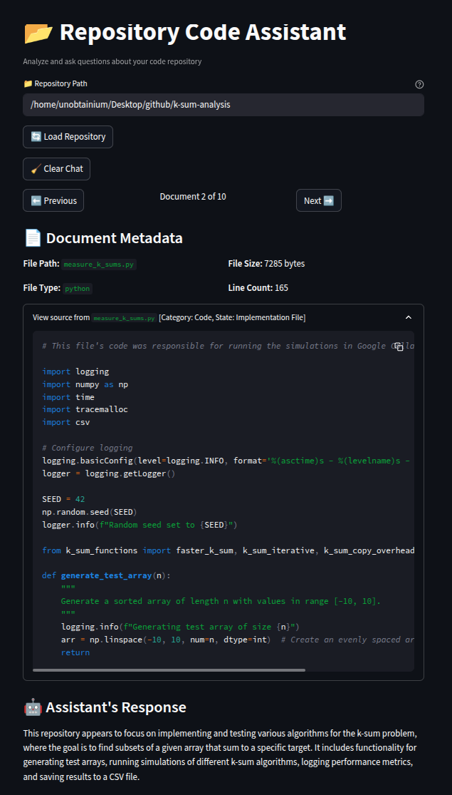

# Important Quick Note

1. My perspective on the continued development of GitHub Chat differed from the direction it took. I envisioned a more iterative development process, with a strong emphasis on comprehensive logging and enhanced developer tooling on the front end to provide deeper insights. 

2. It's part-way through a complete rewrite, so I'm not going to continue with it whenever I get time.

3. The rewrite was going to include:
    - Migration away from streamlit to something with better state management on the frontend. I haven't been fully sold on Next.js, so I was likely going to do a React/Typescript + Redux/Toolkit implementation.
    - A more robust logging system, with a focus on developer experience.
    
    The reason I wanted to switch over was because it got insanely messy trying to manage the state of the chat interface with streamlit. I wasn't able to have clean pagination for the top-k context documents, and having a new instance to page through for each agent response.

Here's a breif glimpse at what a chat looked like on the front end if you're too lazy to run everything:



# RAG Code Assistant

A Retrieval-Augmented Generation (RAG) system for analyzing and understanding code repositories. The system provides both a command-line interface and a web UI for interacting with your codebase. In this repo there are two versions of the RAG system:

1. `app.py` - a demo version that uses test data
2. `app_repo.py` - a version that uses a real codebase

It is still a work in progress and lots of things can be improved.

# Repository Architecture

This document explains how the different components of the RAG (Retrieval-Augmented Generation) system work together.

## File Structure and Dependencies

```mermaid
graph TD
    config[config.py] --> rag[rag.py]
    config --> data_pipeline[data_pipeline.py]
    data_pipeline --> test_rag[test_rag.py]
    data_pipeline --> app_repo[app_repo.py]
    rag --> app[app.py]
    rag --> app_repo
    test_rag --> app
```

## Data Flow

```mermaid
flowchart TD
    subgraph Input
        A[User Query] --> B[Streamlit Interface]
        C[Repository/Documents] --> D[Document Processor]
    end

    subgraph Processing
        B --> E[RAG System]
        D --> F[Text Splitter]
        F --> G[Embedder]
        G --> H[FAISS Index]
        H --> E
    end

    subgraph Output
        E --> I[Response]
        E --> J[Context]
        I --> K[Chat Interface]
        J --> K
    end
```

## Features

- Code-aware responses using RAG
- Memory for maintaining conversation context
- Support for multiple programming languages
- Interactive web interface
- Command-line interface

## Setup

1. Install dependencies:
```bash
poetry install
```

2. Set up OpenAI API key:

Create a `.streamlit/secrets.toml` file in your project root:
```bash
mkdir -p .streamlit
touch .streamlit/secrets.toml
```

Add your OpenAI API key to `.streamlit/secrets.toml`:
```toml
OPENAI_API_KEY = "your-openai-api-key-here"
```

## Running the Application

### Web Interface

1. Run the demo version (with test data):
```bash
poetry run streamlit run github_chat/app_repo.py
```

2. Run the repository analysis version:
```bash
poetry run streamlit run github_chat/app_repo.py
```

### Command Line Interface

Run the RAG system directly (Might need to fix this later.):
```bash
poetry run python rag.py
```

## Usage Examples

1. **Demo Version (app.py)**
   - Ask about Alice (software engineer)
   - Ask about Bob (data scientist)
   - Ask about the company cafeteria
   - Test memory with follow-up questions

2. **Repository Analysis (app_repo.py)**
   - Enter your repository path
   - Click "Load Repository"
   - Ask questions about classes, functions, or code structure
   - View implementation details in expandable sections

## Security Note

- Never commit your `.streamlit/secrets.toml` file
- Add it to your `.gitignore`
- Keep your API key secure

## Example Queries

- "What does the RAG class do?"
- "Show me the implementation of the Memory class"
- "How is data processing handled?"
- "Explain the initialization process"

## TODO

- [ ] Add evaluation metrics
- [ ] Improve the embedding model
- [ ] Improve the text splitter and chunking
- [ ] Improve the retriever